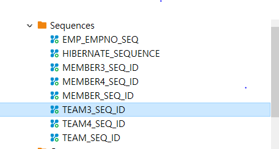
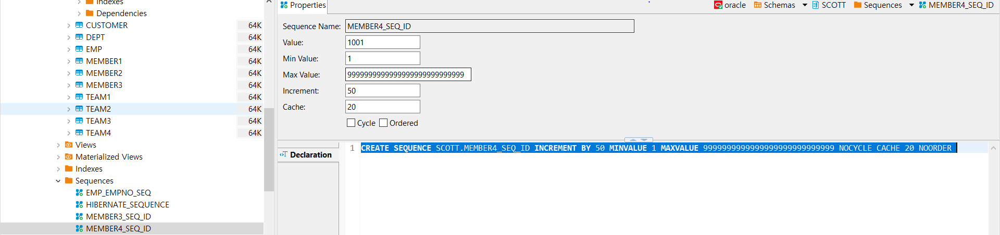
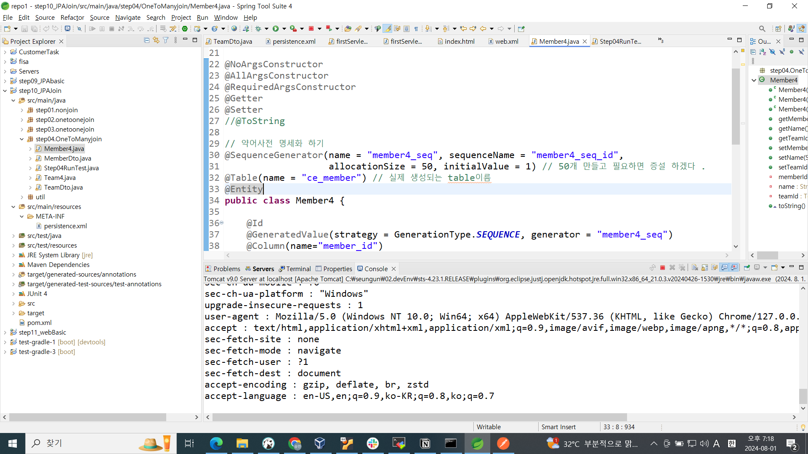
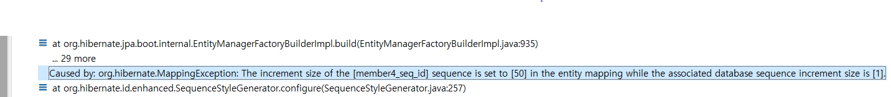
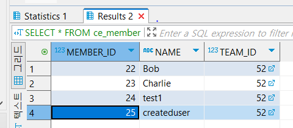

# JPA Join 및 CRUD 학습 내용 정리 📚

<h2 style="font-size: 25px;"> ✨개발팀원 ✨<br>
</h2>


|||||
|:-:|:-:|:-:|:-:|
|[@이아영](https://github.com/ayleeee)|[@신혜원](https://github.com/haewoni)|[@이승언](https://github.com/seungunleeee)|[@손대현](https://github.com/daehyeon)|
---
<br>

DB 제어에 한계가 있는 상황을 가정하여 ```<property name="hibernate.hbm2ddl.auto" value="none" /> ```인 상태에서
기존의 데이터에 crud를 수행하였다.

먼저 <b>Create</b> , <b>Update</b> , <b>Delete</b>를 하는 과정에서 동일한 에러를 마주하였다.
<br>예제로 제공받은 코드의 <b>@GeneratedValue</b> 어노테이션은 emp1 , dept1 테이블에 존재하지 않는 sequence에 매핑을 하고 있다.
따라서 데이터베이스에 추가 , 수정 , 삭제하는 과정에서 그림과 같은 에러가 발생했다.<br>

<p align="center">
 
</p>

<b>@GeneratedValue</b>와 sequence의 관계가 존재하지 않았음에도 예제를 제공받았을 때 sequence 문제를 고려하지 않은채 추가, 수정, 삭제 작업을 한 것이 문제였다.

문제를 해결하기 위해 @GeneratedValue와 sequence들간의 관계를 DBeaver를 사용하여 확인해 보기로 하였다. 여러 번 검토한 결과, 이 두 요소 사이에는 아무런 연관성이 없다는 것을 발견하였다. 그래서 @GeneratedValue를 삭제한 후, 다시 추가, 수정, 삭제 작업을 수행해보았고, 최종적으로 모든 작업이 문제 없이 동작하는 것을 확인하였다. 

이후 DB에 이미 Sequence를 통해 id가 자동으로 증가되도록 관리되고 있는 상황에서
@GeneratedValue를 작성하여 CRUD를 할 수 있도록 실습을 하였다.

먼저 DBeaver에서 sql을 이용하여 테이블을 생성하였고 이후 sequence를 추가하여
자동으로 값이 추가되도록 하였다.

```java
@Table(name = "ce_member") // 실제 생성되는 table이름 
@Entity
@SequenceGenerator(name = "member4_seq", sequenceName = "member4_seq_id", 
				   allocationSize = 50, initialValue = 1) // 50개 만들고 필요하면 증설 하겠다 . 
public class Member4 {

	@Id
	@GeneratedValue(strategy = GenerationType.SEQUENCE, generator = "member4_seq") 
	@Column(name="member_id")
	private long memberId;
}
```

더미 데이터를 추가해 놓은 상태에서 생성한 테이블에 대하여 @Entity 클래스를 작성하였다.


```java
@Table(name = "ce_member") // 실제 생성되는 table이름 
@Entity
@SequenceGenerator(name = "member4_seq", sequenceName = "member4_seq_id")  
public class Member4 {

	@Id
	@GeneratedValue(strategy = GenerationType.SEQUENCE, generator = "member4_seq") 
	@Column(name="member_id")
	private long memberId;
```

```allocationSize = 50, initialValue = 1```은 sequence를 jpa를 이용해 생성할 경우 사용한다. 현재 우리의 목표는 DB에 기존에 적용되어있는 sequence에 맞게 CRUD를 수행하는 것이기에,  ```allocationSize = 50, initialValue = 1```를 지우고 아래와 같이 작성한 후 CRUD를 수행하였다.

<p align="center">
 
</p>
<p align="center">
 
</p>

기존의 sequence에 해당하는 값들로 id가 저장되는 것을 확인할 수 있었다.


## 전체 코드 리뷰 ⌨


### 1. Emp1.java
```java
package review;

import java.time.LocalDateTime;

import javax.persistence.Column;
import javax.persistence.Entity;
import javax.persistence.GeneratedValue;
import javax.persistence.GenerationType;
import javax.persistence.Id;
import javax.persistence.JoinColumn;
import javax.persistence.OneToOne;
import javax.persistence.SequenceGenerator;
import javax.persistence.Table;

import lombok.AllArgsConstructor;
import lombok.Getter;
import lombok.NoArgsConstructor;
import lombok.NonNull;
import lombok.RequiredArgsConstructor;
import lombok.Setter;

@NoArgsConstructor
@AllArgsConstructor
@RequiredArgsConstructor
@Getter
@Setter
@Table(name = "EMP")
//@SequenceGenerator(name = "emp1_seq", sequenceName = "emp1_seq_id", allocationSize = 10, initialValue = 1)
@Entity
public class Emp1 {

	@Id
//	@GeneratedValue(strategy = GenerationType.SEQUENCE, generator = "emp1_seq") 
	@Column(name = "EMPNO")
	private int empNo;

	@NonNull
	@Column(name = "ENAME")
	private String eName;

	@NonNull
	@Column(name = "JOB")
	private String job;

	@Column(name = "MGR")
	private Integer mgr;

	@NonNull
	@Column(name = "HIREDATE")
	private LocalDateTime hiredate;

	@NonNull
	@Column(name = "SAL")
	private Double sal;

	@Column(name = "COMM")
	private Double comm;

	@NonNull
	@OneToOne
	@JoinColumn(name = "DEPTNO")
	private Dept1 deptNo;

	@Override
	public String toString() {
		StringBuilder builder = new StringBuilder();
		builder.append("Emp1 [empNo=");
		builder.append(empNo);
		builder.append(", eName=");
		builder.append(eName);
		builder.append(", job=");
		builder.append(job);
		builder.append(", mgr=");
		builder.append(mgr);
		builder.append(", hiredate=");
		builder.append(hiredate);
		builder.append(", sal=");
		builder.append(sal);
		builder.append(", comm=");
		builder.append(comm);
		builder.append(", deptNo=");
		builder.append(deptNo.getDeptNo());
		builder.append("]");
		return builder.toString();
	}
}
```

### 1. Dept1.java
```java
package review;

import java.util.ArrayList;
import java.util.List;

import javax.persistence.Column;
import javax.persistence.Entity;
import javax.persistence.GeneratedValue;
import javax.persistence.GenerationType;
import javax.persistence.Id;
import javax.persistence.OneToMany;
import javax.persistence.SequenceGenerator;
import javax.persistence.Table;

import lombok.Getter;
import lombok.NoArgsConstructor;
import lombok.NonNull;
import lombok.RequiredArgsConstructor;
import lombok.Setter;
import lombok.ToString;

@NoArgsConstructor
@RequiredArgsConstructor

@Getter
@Setter
@ToString
@Table(name = "DEPT")
//@SequenceGenerator(name = "dept1_seq", sequenceName = "dept1_seq_id", allocationSize = 10, initialValue = 1)
@Entity
public class Dept1 {

	@Id
	@NonNull
//	@GeneratedValue(strategy = GenerationType.SEQUENCE, generator = "dept1_seq") 
	@Column(name = "DEPTNO")
	private Integer deptNo;

	@NonNull
	@Column(name = "DNAME")
	private String dName;

	@NonNull
	@Column(name = "LOC")
	private String loc;
	
	@OneToMany(mappedBy = "deptNo")
	private List<Emp1> emp1 = new ArrayList<>();
}
```

### 3. Review.java
- JPA의 join 적용 후 Create (insert)
```java
package review;

import javax.persistence.EntityManager;
import javax.persistence.EntityTransaction;

import org.junit.Test;

import util.DBUtil;

public class Review {
	
	@Test
	public void reviwewCreate() {
		EntityManager em = null;
		EntityTransaction tx = null;
		
		try {
			em = DBUtil.getEntityManager();
			tx = em.getTransaction();
			tx.begin();
			
			// CRUD 적용
			
			// Create를 통해 row하나 생성
			Dept1 newDept = new Dept1(55, "fisa", "seoul");
			em.persist(newDept);
			
			System.out.println("-- dept 조회 : " + em.find(Dept1.class, 10));

			tx.commit();
			em.clear();
			
		}catch(Exception e) {
			tx.rollback();
			e.printStackTrace();
		}finally {
			if(em != null) {
				em.close();
				em = null;
			}
		}
	}
```
- JPA의 join 적용 후 Read (select)

```java
	@Test
	public void reviwewRead() {
		EntityManager em = null;
		EntityTransaction tx = null;
		
		try {
			em = DBUtil.getEntityManager();
			tx = em.getTransaction();
			tx.begin();
			
			// CRUD 적용
			
			// Read = select
			System.out.println("-- dept 조회 : " + em.find(Dept1.class, 40)); //join 되어있지 않아 값이 출력 되지 않음
			System.out.println("-- emp 조회 : " + em.find(Emp1.class, 7839)); // 7839의 empno에 해당하는 값 정상 출력
			
			int deptnoSum = em.createQuery("select d from Dept1 d where d.deptNo > 30", Dept1.class)
				      		.getResultStream()
				      		.mapToInt(Dept1::getDeptNo).sum();
			// deptNo가 30을 초과한 값들의 합을 출력하는 쿼리문 생성 

			tx.commit();
			em.clear();
			
		}catch(Exception e) {
			tx.rollback();
			e.printStackTrace();
		}finally {
			if(em != null) {
				em.close();
				em = null;
			}
		}
	}
```
- JPA의 join 적용 후 Update (setXxx)

```java
	@Test
	public void reviwewUpdate() {
		EntityManager em = null;
		EntityTransaction tx = null;
		
		try {
			em = DBUtil.getEntityManager();
			tx = em.getTransaction();
			
			// CRUD 적용
			Dept1 deptRes = em.find(Dept1.class, 10);
			Emp1 empRes = em.find(Emp1.class, 7839);
			System.out.println("-- dept 조회 : " + deptRes);
			System.out.println("-- emp 조회 : " + empRes);
			
			// Update - Dept1의 10번 
			tx.begin();
			
			deptRes.setDName("FENCING");
			empRes.setEName("오상욱");
			
			tx.commit();
			em.clear();
			
			System.out.println("-- dept dname field 업데이트 후 조회 : " + em.find(Dept1.class, 10));
			System.out.println("-- emp ename field 업데이트 후 조회 : " + em.find(Emp1.class, 7839));
			
		}catch(Exception e) {
			tx.rollback();
			e.printStackTrace();
		}finally {
			if(em != null) {
				em.close();
				em = null;
			}
		}
	}
```
- JPA의 join 적용 후 Delete (remove)
```java	
	@Test
	public void reviwewDelete() {
		EntityManager em = null;
		EntityTransaction tx = null;
		
		try {
			em = DBUtil.getEntityManager();
			tx = em.getTransaction();
			
			// CRUD 적용 - deptNo가 60인 값을 검색
			Dept1 deptRes = em.find(Dept1.class, 60);
			System.out.println("-- Delete 전 dept 조회 : " + deptRes);

			// Delete = remove - 검색 후 remove를 통해 해당 값 삭제
			tx.begin();
			em.remove(deptRes);
			tx.commit();
			em.clear();
			
			System.out.println("-- Delete 후 dept 조회 : " + em.find(Dept1.class, 60));
			
		}catch(Exception e) {
			tx.rollback();
			e.printStackTrace();
		}finally {
			if(em != null) {
				em.close();
				em = null;
			}
		}
	}
}
```
- 정리한 JAVA 코드
```java
@NoArgsConstructor
@AllArgsConstructor
@RequiredArgsConstructor 
@Getter
@Setter
@ToString

// allocationSize 는 Sequence에 정의된  INCREMENT BY 와 동일해야 합니다. 
@SequenceGenerator(name = "member4_seq", sequenceName = "member4_seq_id", allocationSize = 1)  
@Table(name = "ce_member") // 생성되있는 테이블과 매핑할 테이블 명 
@Entity
public class Member4 {
	@Id
	@GeneratedValue(strategy = GenerationType.SEQUENCE, generator = "member4_seq") 
	@Column(name="member_id")
	private long memberId;
	
	@NonNull
	@Column(length = 20) 
	private String name;
	
	@NonNull

	@ManyToOne
	@JoinColumn(name="team_id")
	private Team4 teamId;
	
}


public class Step04RunTest {

	@Test
	public void step01Test() {
		EntityManager em = null;
		EntityTransaction tx = null;

		try {
			em = DBUtil.getEntityManager();
			tx = em.getTransaction();
// select 
//			Member4 member = em.find(Member4.class,21L);
//			System.out.println( member );
			
			tx.begin();
// create			
//			em.persist(new Member4("createduser",em.find(Team4.class, 52L)));
			
			
// update   member.setName("updatedName");
			
			
//	remove		em.remove(member);
			tx.commit();
			em.clear();
			System.out.println(  em.find(Member4.class,21L) );

			

		} catch (Exception e) {
			tx.rollback();
			e.printStackTrace();
		} finally {
			if (em != null) {
				em.close();
				em = null;
			}
		}

	}
```
JPA에 선언된 allocationSize값과 DB에 정의된 sequence의 increment by값이 다를경우 그림과 같은 오류가 발생한다.

<p align="center">
 
</p>

- SQL로 작성한 테이블 생성 및 시퀀스 생성
```sql
DROP TABLE CE_MEMBER ;

#테이블 생성
CREATE TABLE ce_member (
    member_id NUMBER PRIMARY KEY,
    name VARCHAR2(20) NOT NULL,
    team_id NUMBER NOT NULL,
    CONSTRAINT fk_team FOREIGN KEY (team_id) REFERENCES team4(team_id)
);
#시퀀스 생성 
CREATE SEQUENCE member4_seq_id
    INCREMENT BY 1
    MINVALUE 1
    MAXVALUE 9999999999999999999999999999
    NOCYCLE
    CACHE 20
    ORDER;
    
   
#더미 데이터 추가
INSERT INTO ce_member (member_id, name, team_id) VALUES (member4_seq_id.NEXTVAL, 'Alice', 52);
INSERT INTO ce_member (member_id, name, team_id) VALUES (member4_seq_id.NEXTVAL, 'Bob', 52);
INSERT INTO ce_member (member_id, name, team_id) VALUES (member4_seq_id.NEXTVAL, 'Charlie', 52);

```
- 결과값 출력

<p align="center">
 
</p>
